## Cloud Formation:

* Model and provision all your cloud infrastructure
* AWS CloudFormation provides a common language to describe and provision all the infrastructure resources in your environment in a safe, repeatable way.

### How it works ?

1) Code your infrastructure using the CloudFormation template language in the YAML or JSON format, or start from many available sample templates.
2) Use AWS CloudFormation via the browser console, command line tools, or APIs to create a stack based on your template code.
3) AWS CloudFormation provisions and configures the stacks and resources you specified in your template.

    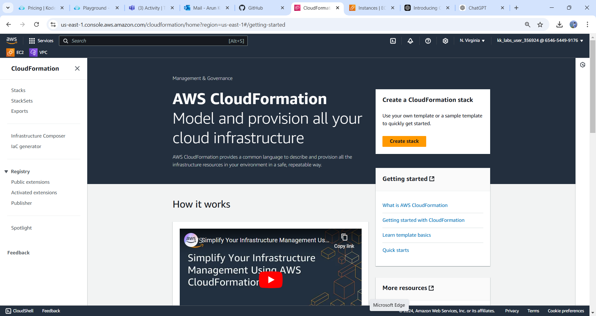

#### STEP-1 :

* Now we have to create a stack( a stack is a collection of related resources that are managed as a single unit)

    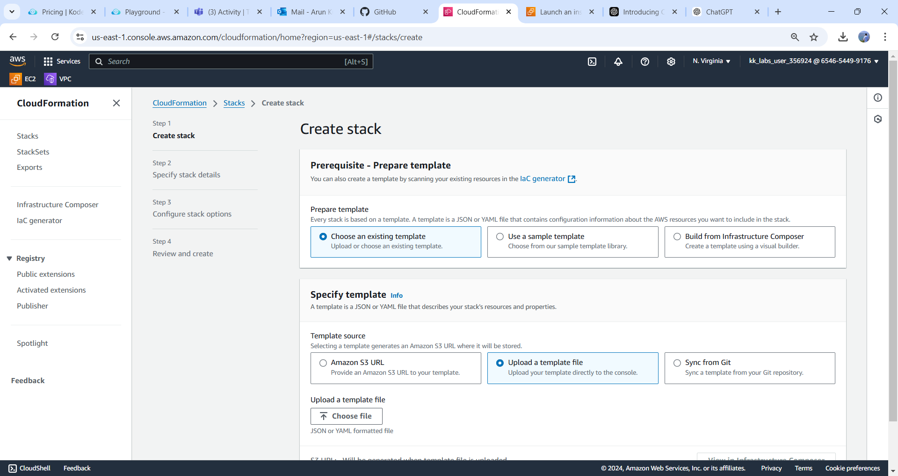

* upload or choose an exsiting template(yaml/json).
* upload a template file,and click on `Next`.
* create a stack name(CFstack)

   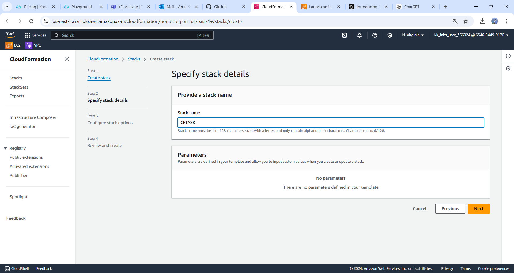

* If the Template is in correct format either it is json/yaml it will excute the template without showing error,Finally click on `Submit`

* After creation it shows `EVENT` it shows stack is creating or not.

   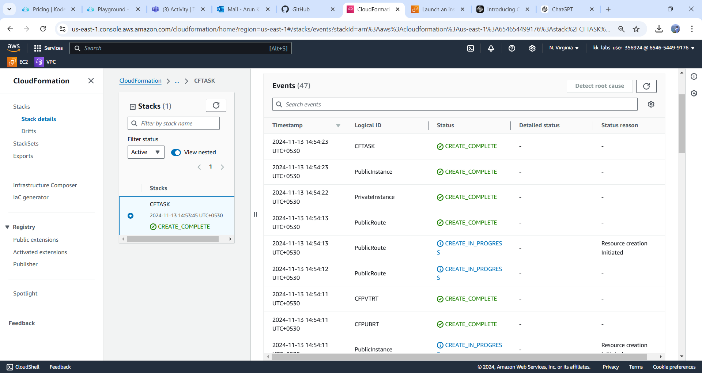

*If it is created once check the created `(resourcesvpc,subnets,routes,ec2,internetgateway)`,If it is Fails once check the Template inundation.

* Below Image shows the Inundation Error 

  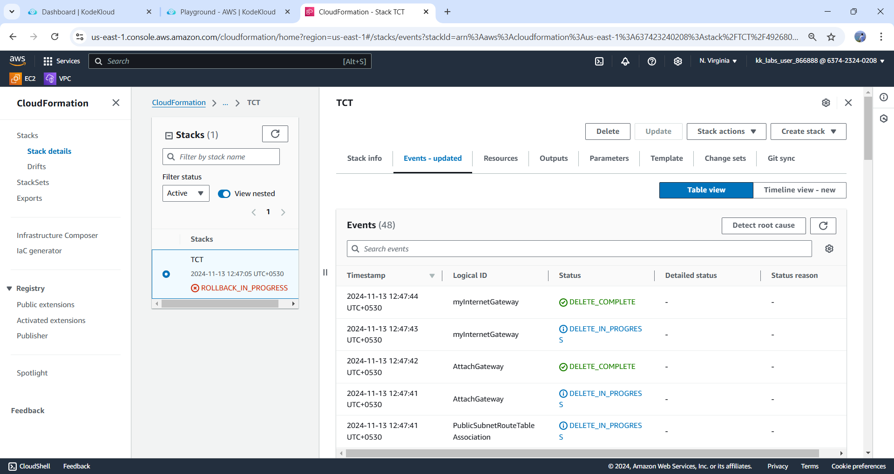

#### STEP-2 :

* Create a Template for a vpc creation,ensure CIDR range and vpc name.

* vpc allows you to create a virtual network within the AWS cloud for your AWS account.

  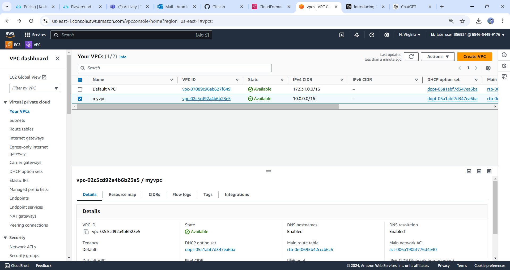

#### STEP-3 :

* create a template for a subnets(public,private),ensure cidr block range and subnet names.
* A subnet, or subnetwork, is a network inside a network. Subnets make networks more efficient.

  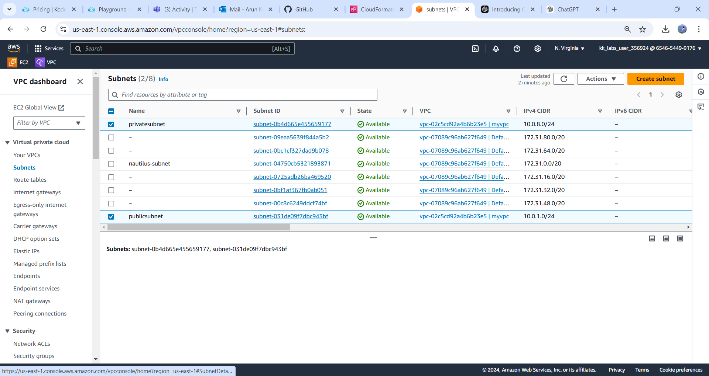

#### STEP-4 :

* create a template for a intergateway.
* Internetgateway allows communication between a Virtual Private Cloud (VPC) and the internet

  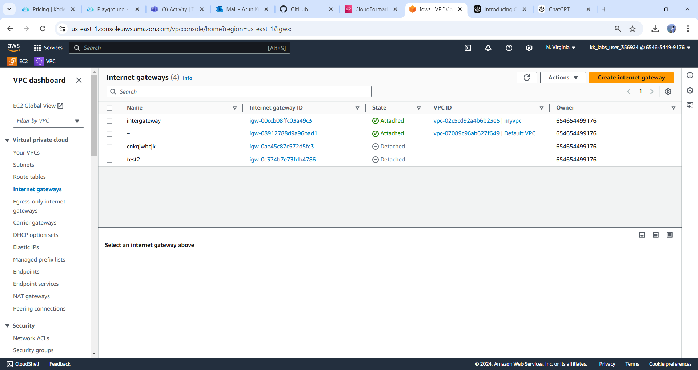

#### STEP-5 :

* crate a template for Attach internet gateway to your vpc.
* To enable communication between the VPC and the internet.`(Attaching igw to vpc)`

#### STEP-6 :

* Create a template for Public & private Route tables.
* Route tables are used to control how network traffic is directed

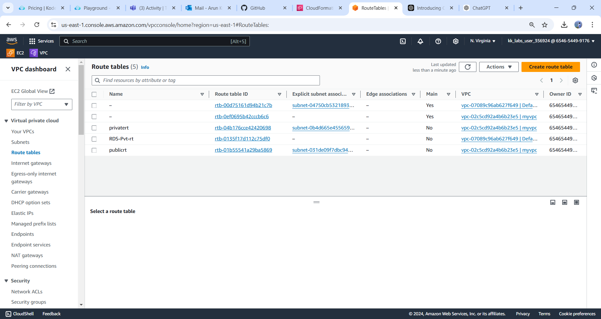

#### STEP-7 :

* create a template for private & public subnet Route table Associatons.

* You can associate route tables to control where network traffic is directed.

Below Images can shows the public subnet Associations.

Below Image shows the private subnet Associations

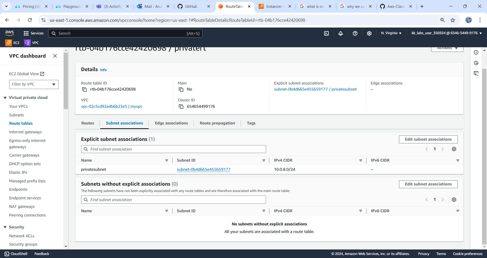

#### step-8 :

* Create a template for attaching internet gateway to public route

#### STEP-9 :

* Create a templete for Security groups for SSH & HTTP
* Secure Shell (SSH) is a network protocol that allows secure communication between computers over an unsecured network.

* HTTP-Hypertext Transfer Protocol  is used to load webpages using hypertext links

* The purpose of a security group is to control access to sensitive data and resources, and to manage traffic.

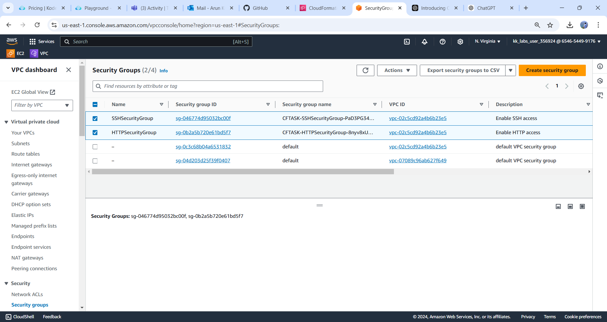

#### STEP-10 :

* Create a template for Ec2 instances in (public and private) subnets

* EC2 instances is to provide scalable computing capacity for running applications .

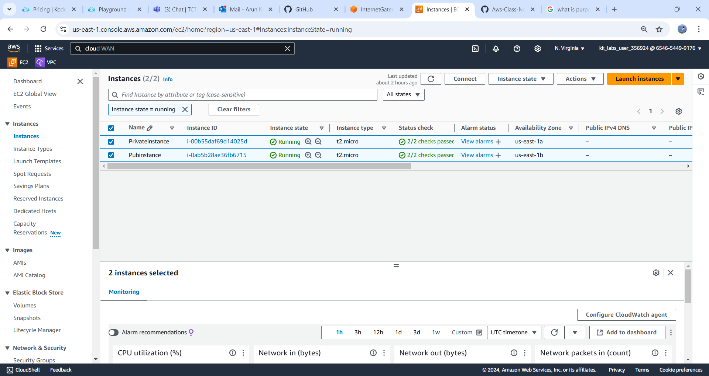

 

