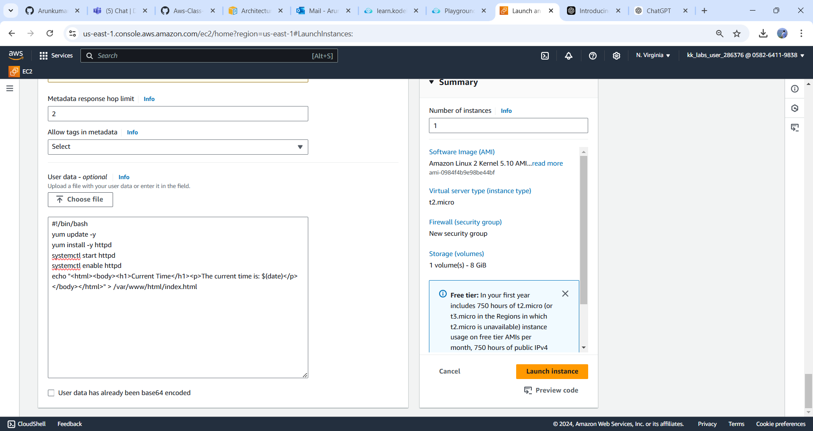
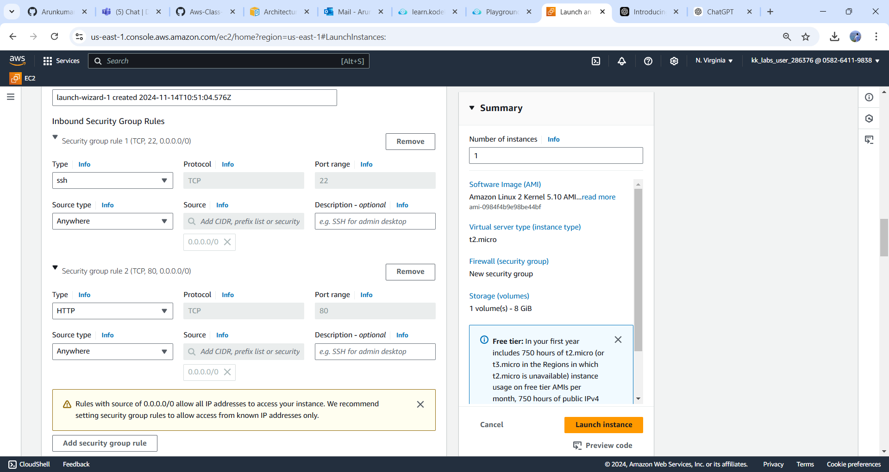
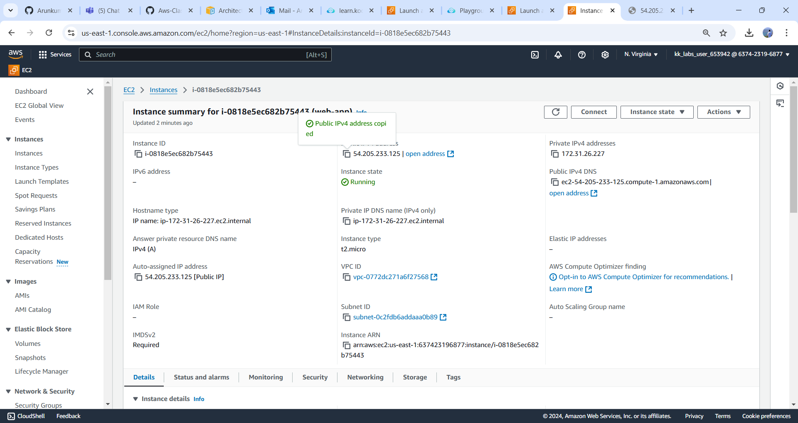
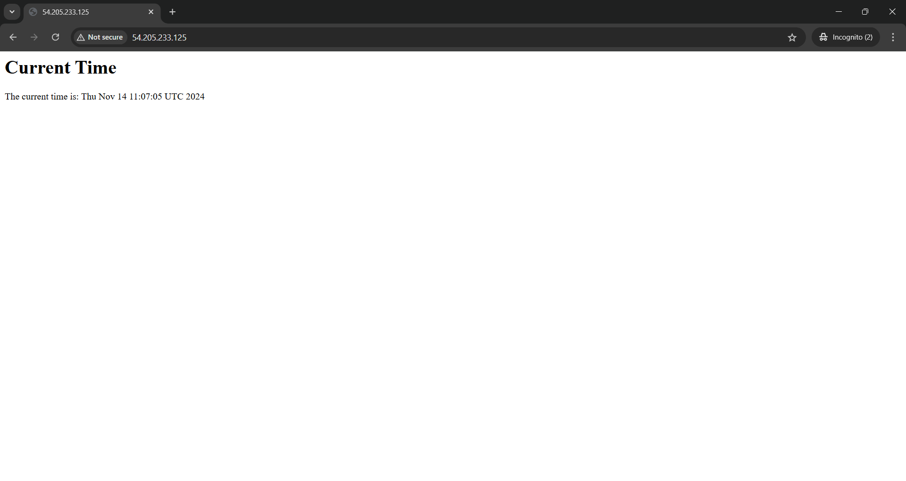
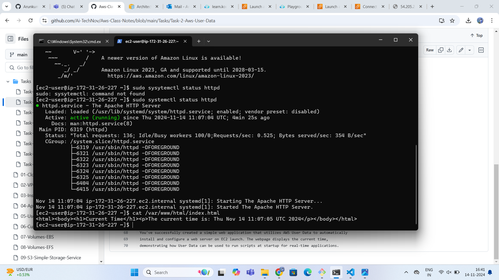

# Project Overview: Real-Time Web Application with User Data

In this project, we will launch an EC2 instance that automatically installs and configures a simple web application using a User Data script. This application will serve a webpage that displays real-time data, such as the current time.

---

### Step 1: Create an EC2 Instance with User Data

##### Log in to the AWS Management Console
- Navigate to the EC2 dashboard.

#### Launch an Instance
1. Click on Launch Instance.
2. Choose an Amazon Machine Image (AMI), such as Amazon Linux 2.
3. Select an instance type (e.g., `t2.micro` for the free tier).
4. In the "Configure Instance" step, look for the User Data section.

  

####  Add User Data Script
- In the User Data field, enter the following script

   ```bash
   #!/bin/bash
   yum update -y
   yum install -y httpd
   systemctl start httpd
   systemctl enable httpd

   # Create a simple HTML page that displays the current time
   echo "<html><body><h1>Current Time</h1><p>The current time is: $(date)</p></body></html>" > /var/www/html/index.html
   ```

####  Configure Security Group
- Allow inbound traffic on:
  - Port `80` (HTTP)
  - Port `22` (SSH)

 


#### Review and Launch
* Choose or create a key pair for SSH access.
* Review your configurations and click Launch

---

### Step 2: Access Your Application

#### Get the Public IP Address
- Once the instance is running, note the public IP address from the EC2 dashboard.



#### Open a Web Browser
- Navigate to `http://your-instance-public-ip`.
- You should see a webpage displaying the current time.

 

---

### Step 3: Verify the User Data Execution

#### SSH into Your Instance

```bash
ssh -i your-key.pem ec2-user@your-instance-public-ip
```

#### Check the Web Server Status

```bash
sudo systemctl status httpd
```

#### Verify the HTML File

```bash
cat /var/www/html/index.html
```


--- 


