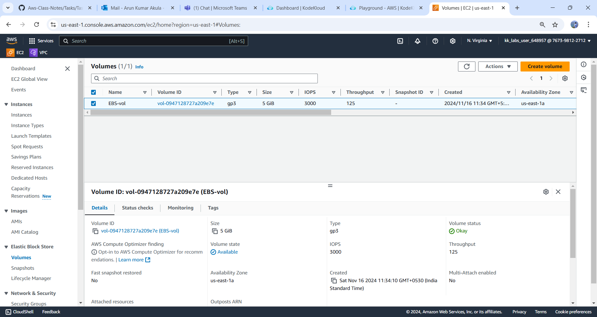

## Real-Time Data Processing Application Using AWS EBS

This guide walks you through creating a real-time note-taking application using AWS Elastic Block Store (EBS) with a Node.js backend.

### Prerequisites
- An AWS account
- AWS CLI installed and configured
- Elastic Beanstalk CLI (EB CLI) installed
- Basic knowledge of Node.js

---

### Step 1: Create and Attach an EBS Volume

* Log in to the AWS Management Console
  - Navigate to the EC2 dashboard.

* #### Create an EBS Volume
1. In the EC2 dashboard, go to `Volume`s in the left sidebar.
2. Click `Create Volume`.
3. Choose the volume type (e.g., General Purpose SSD).
4. Specify the size and ensure the `Availability Zone` matches your EC2 instance.
5. Click `Create Volume`.



#### Attach the EBS Volume to an EC2 Instance :
1. Select the created volume.
2. Right-click and choose `Attach Volume`.
3. Select your EC2 instance and click `Attach`.

### 1.4: Log into Your EC2 Instance
```bash
ssh -i your-key.pem ec2-user@your-instance-public-dns
```

### 1.5: Format and Mount the EBS Volume
1. Check available disks:
   ```bash
   lsblk
   ```
2. Format the volume (replace `/dev/xvdf` with your device):
   ```bash
   sudo mkfs -t ext4 /dev/xvdf
   ```
3. Create a mount point and mount the volume:
   ```bash
   sudo mkdir /mnt/mydata
   sudo mount /dev/xvdf /mnt/mydata
   ```

### 1.6: Persist the Mount Across Reboots
Add the following entry to `/etc/fstab`:
```bash
echo '/dev/xvdf /mnt/mydata ext4 defaults,nofail 0 2' | sudo tee -a /etc/fstab
```

---

## Step 2: Set Up Your Node.js Application

### 2.1: Create a New Project Directory
```bash
mkdir note-app
cd note-app
```

### 2.2: Initialize the Node.js Project
```bash
npm init -y
```

### 2.3: Install Required Packages
```bash
npm install express body-parser fs
```

### 2.4: Create the Server
1. Create a file named `server.js`:
   ```javascript
   const express = require('express');
   const bodyParser = require('body-parser');
   const fs = require('fs');
   const path = require('path');

   const app = express();
   const PORT = process.env.PORT || 3000;
   const DATA_FILE = '/mnt/mydata/notes.txt'; // Path to EBS volume

   app.use(bodyParser.json());
   app.use(express.static('public'));

   app.get('/notes', (req, res) => {
       fs.readFile(DATA_FILE, 'utf8', (err, data) => {
           if (err) {
               return res.status(500).send('Error reading notes');
           }
           res.send(data);
       });
   });

   app.post('/notes', (req, res) => {
       const note = req.body.note;
       fs.appendFile(DATA_FILE, note + '\n', (err) => {
           if (err) {
               return res.status(500).send('Error saving note');
           }
           res.send('Note saved');
       });
   });

   app.listen(PORT, () => {
       console.log(`Server is running on port ${PORT}`);
   });
   ```

---

## Step 3: Create a Simple Frontend

### 3.1: Set Up the Frontend Directory
1. Create a directory named `public`:
   ```bash
   mkdir public
   ```
2. Inside it, create an `index.html` file:
   ```html
   <!DOCTYPE html>
   <html>
   <head>
       <title>Real-Time Notes</title>
   </head>
   <body>
       <h1>Notes</h1>
       <div id="notes"></div>
       <textarea id="note" placeholder="Write a note..."></textarea>
       <button id="save">Save Note</button>

       <script>
           const notesDiv = document.getElementById('notes');
           const noteInput = document.getElementById('note');

           function loadNotes() {
               fetch('/notes')
                   .then(response => response.text())
                   .then(data => {
                       notesDiv.textContent = data;
                   });
           }

           document.getElementById('save').onclick = function() {
               const note = noteInput.value;
               fetch('/notes', {
                   method: 'POST',
                   headers: {
                       'Content-Type': 'application/json'
                   },
                   body: JSON.stringify({ note })
               }).then(() => {
                   noteInput.value = '';
                   loadNotes();
               });
           };

           loadNotes(); // Load notes on page load
       </script>
   </body>
   </html>
   ```

---

## Step 4: Run the Application

1. Start the server:
   ```bash
   node server.js
   ```
2. Open your browser and navigate to:
   ```
   http://<your-EC2-public-dns>:3000
   ```
   Replace `<your-EC2-public-dns>` with your EC2 instance's public DNS.

---

## Step 5: Test and Verify

- Add some notes in the text area and click **Save Note**.
- Refresh the page to see your notes persist using the EBS volume.

--- 

Your real-time application using AWS EBS is now set up! 🎉