### Deploy a Flask App and Create an AWS AMI

#### Step 1: Launch and Configure an EC2 Instance :

1. Log in to AWS Console :
   - Navigate to the EC2 Dashboard.

2. Launch an Instance :
   - Choose Amazon Linux 2 AMI
   - Select the instance type: `t2.micro` (free tier eligible).
   - Configure as follows:
     - Use default instance details.
     - Set storage (default: 8 GiB).

3. Configure Security Group :
   - Add the following rules:
     - `SSH (Port 22)`: Allow access from your IP.
     - `HTTP (Port 80)`: Allow access from anywhere.
     - `Custom TCP (Port 5000)`: Allow access from anywhere.

4. Launch and Connect:
   - Launch the instance.
   - Download the key pair (`your-key.pem`).
   - preview and launch server
   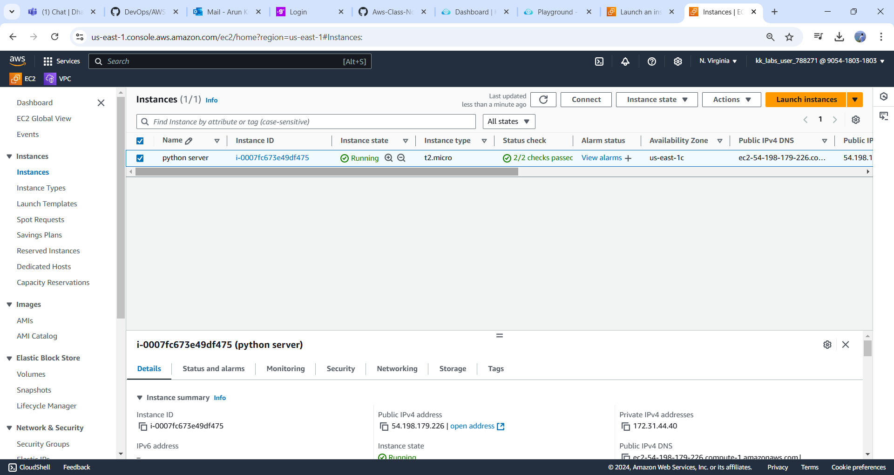
   - Connect using SSH:
     ```bash
     ssh -i your-key.pem ec2-user@<your-public-dns>
     ```
     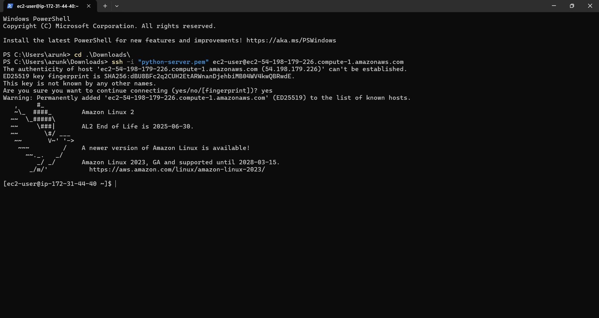
---

Step 2: Install Dependencies

1. **Update Packages**:
   ```bash
   sudo yum update -y
   ```

2. **Install Python and pip**:
   ```bash
   sudo yum install -y python3
   ```

*  Install python and pip3:
```
sudo yum install  python3 pip-y
```
   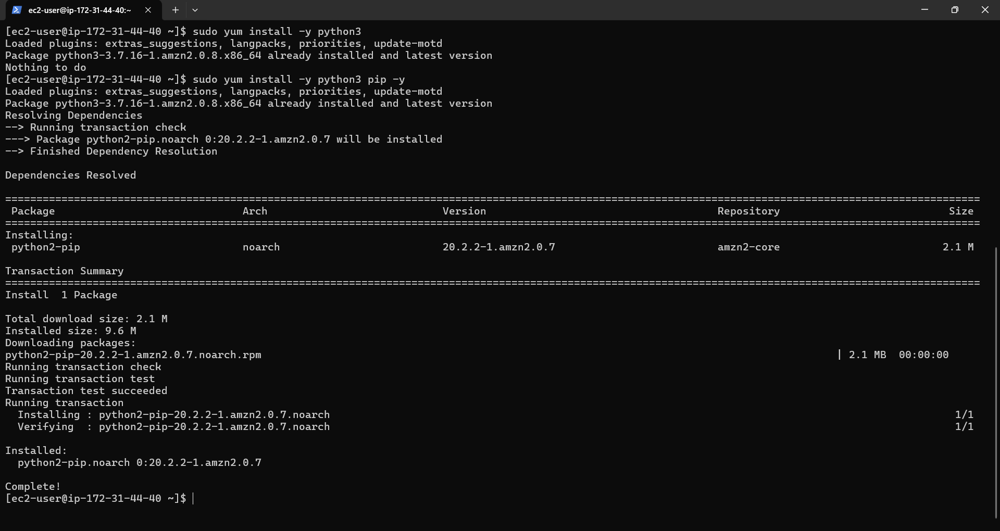

* check pip version
```
pip3 --version
```
  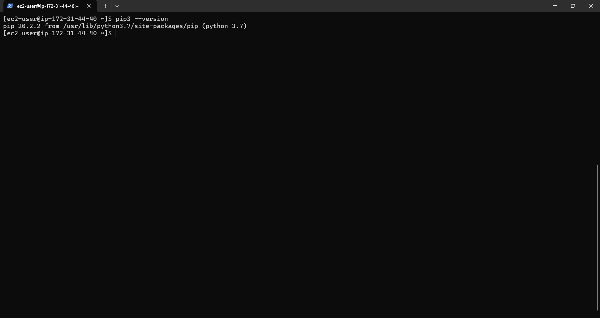

3. Install Flask :
   ```bash
   pip3 install Flask
   ```
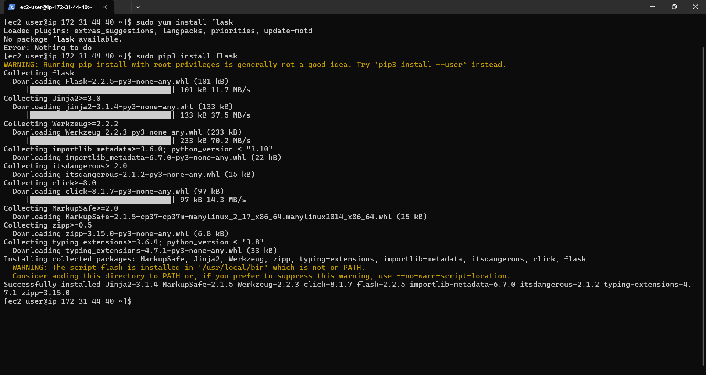
---

Step 3: Create Flask Application

1. Create a Directory :
   ```bash
   mkdir flask-app && cd flask-app
   ```

2. Create Application File :
   - Use a text editor (e.g., `vi`) to create `app.py`:
     ```bash
     vi app.py
     ```

   - Paste the following code:
     ```python
     from flask import Flask
     from datetime import datetime

     app = Flask(__name__)

     @app.route('/')
     def home():
         current_time = datetime.now().strftime("%Y-%m-%d %H:%M:%S")
         return f"<h1>Current Server Time</h1><p>{current_time}</p>"

     if __name__ == '__main__':
         app.run(host='0.0.0.0', port=5000)
     ```


Step 4: Run Flask Application

1. Start the App:
   ```bash
   python3 app.py
   ```
   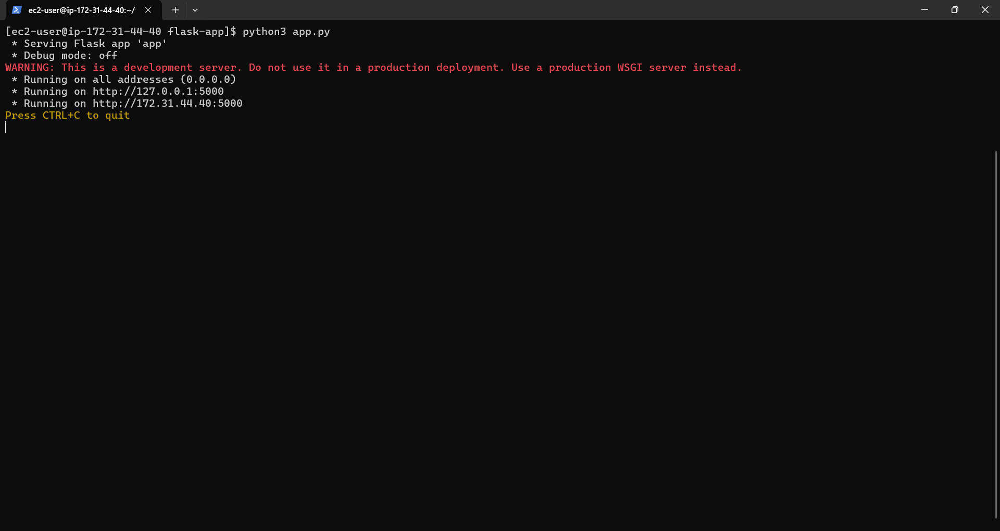
2. **Verify the App**:
   - Open a browser.
   - Navigate to `http://<your-public-dns>:5000`!!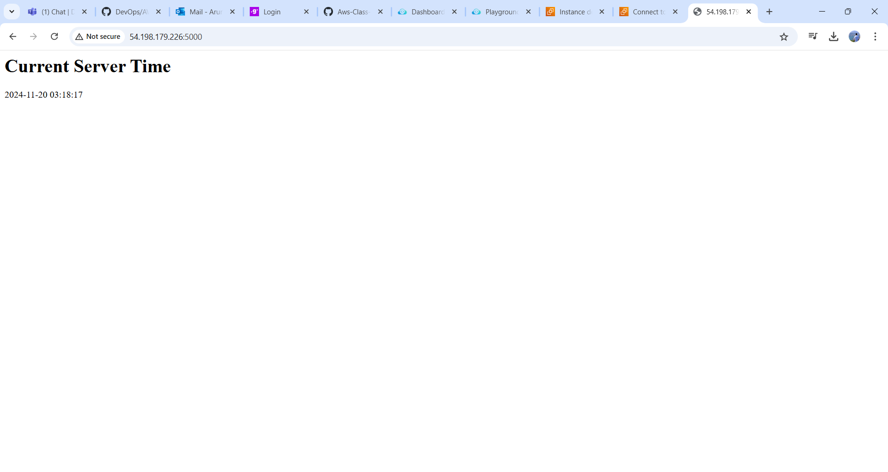
---

Step 5: Create a Custom AMI

1. Create an AMI :
   - Go to the EC2 dashboard.
   - Select the stopped instance(optional).
   - Click on `Actions > Create Image`.
   - Provide a name (e.g., `AppAMI`) and create the image.
  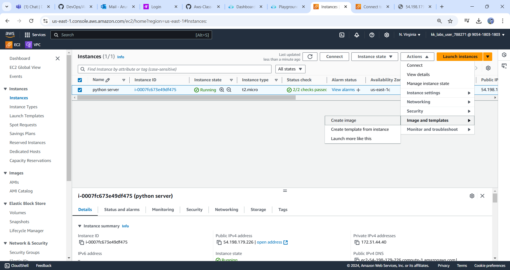
  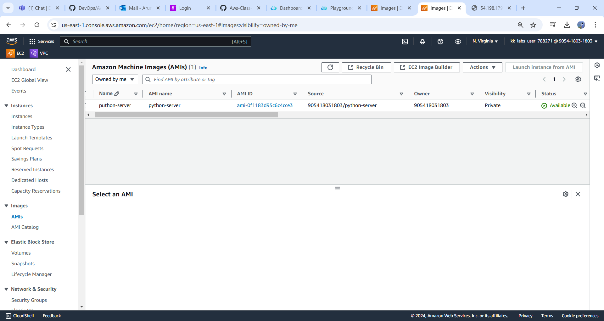
3. Wait for AMI Creation:
   - Go to the AMIs section to monitor progress.
  
---

Step 6: Launch New Instances from AMI

1. Launch a New Instance:
   - Select the created AMI from the AMI section.
   - Configure and launch the instance.
   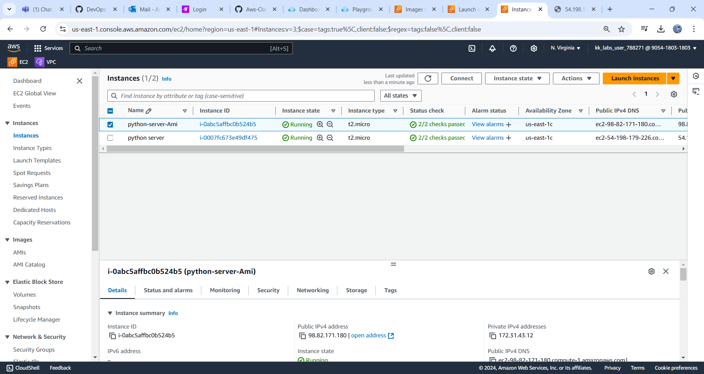

2. Verify Flask App:
   - Connect to the instance change root to ec2-user.
   - Start the application as setp4.
   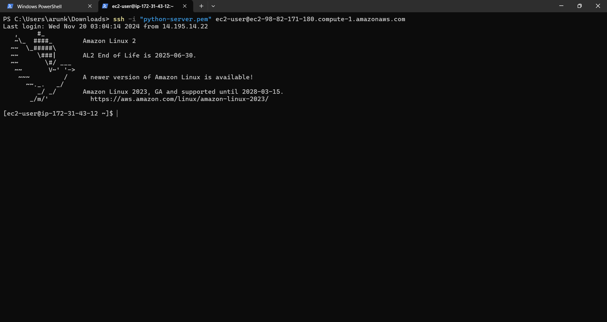
   

3. copy insatance public ip and browse on web
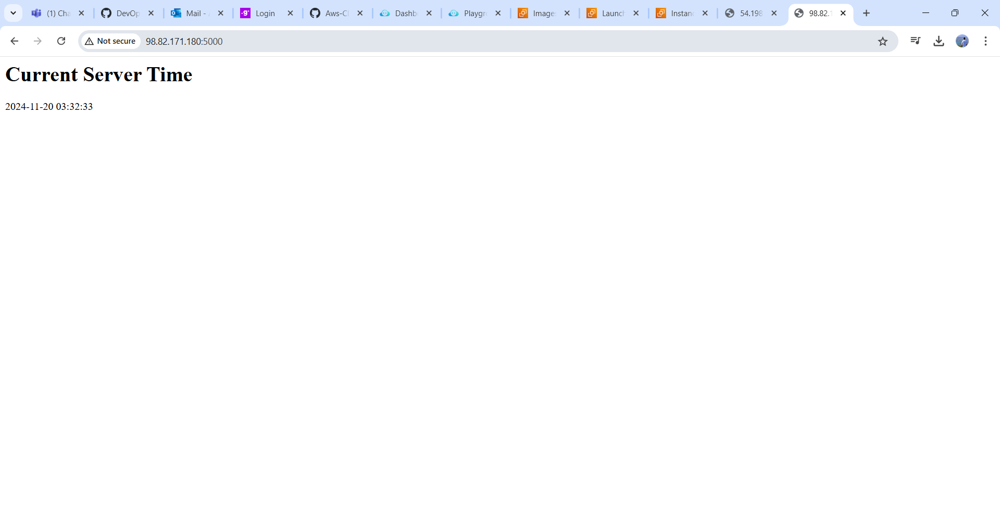

---

Step 7: Cleanup

1. Terminate Instances:
   - After testing, terminate instances you no longer need.

2. Delete the AMI (Optional):
   - If the AMI is no longer needed, delete it from the AMIs section.

---

Conclusion

This guide outlines how to:
- Create a Flask application.
- Deploy it on an EC2 instance.
- Create an AMI for replication.

You can now launch new instances with the pre-configured setup using the custom AMI!
```