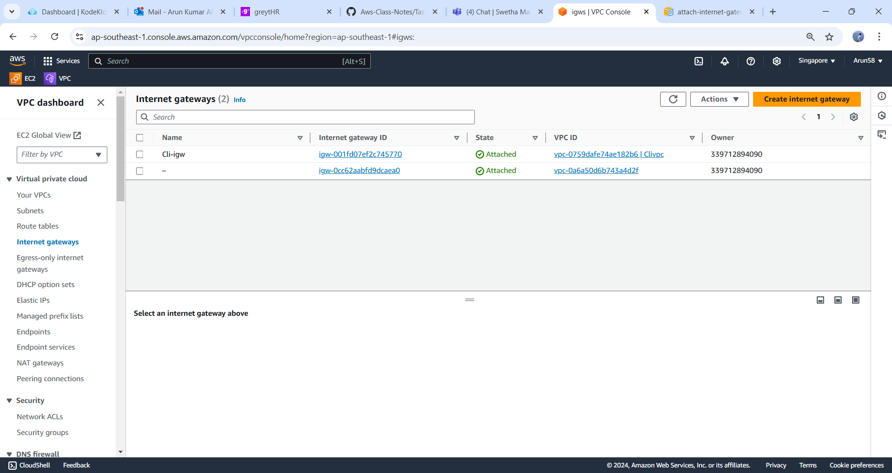
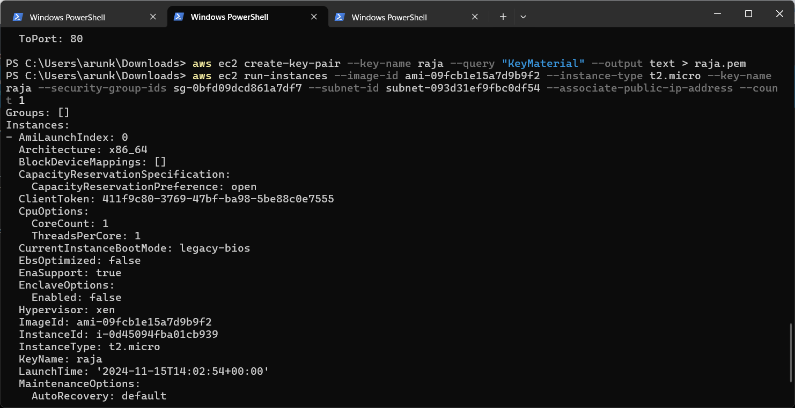
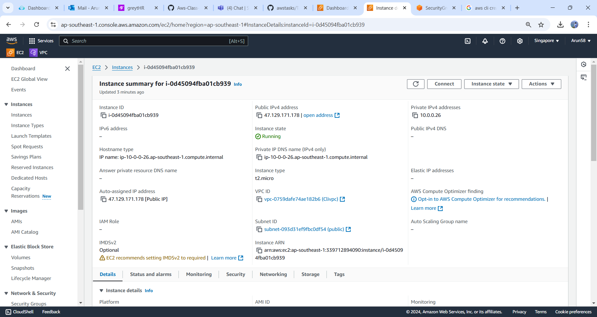

# AWS CLI Setup and Infrastructure Creation

### Step 1: Install and Configure AWS CLI
* Install AWS CLI 
   - Download and install the AWS CLI:  
     [AWS CLI Installation Guide](https://docs.aws.amazon.com/cli/latest/userguide/install-cliv2.html)
   - Verify installation:
     ```bash
     aws --version
     ```

2. **Configure AWS CLI**  
   - Configure your AWS CLI with PA (Programmatic Access) credentials:
     ```bash
     aws configure
     ```
    
     Provide:
     - Access Key ID
     - Secret Access Key
     - Default Region (e.g., `us-east-1`)
     - Output Format(e.g., `json`)
      
   * Here we need to create a credentials

       - Choose IAM dashboard and create a user.
       - select user click on credentails..create

    
  
---

### Step 2: Create a VPC
```bash
aws ec2 create-vpc --cidr-block 10.0.0.0/16
```
- Note down the **VPC ID** (e.g., `vpc-12345678`).

* Create Tags is Optional

  
  

---

#### Step 3: Create Public and Private Subnets
* Create Public Subnet 
   ```bash
   aws ec2 create-subnet --vpc-id <VPC_ID> --cidr-block 10.0.0.0/24 --availability-zone <AZ>
   ```
   Replace `<VPC_ID>` with your VPC ID and `<AZ>` with an Availability Zone (e.g., `us-east-1a`).  
   Note the Subnet ID (e.g., `subnet-123...`).
   
   
   

* Create Private Subnet  
   ```bash
   aws ec2 create-subnet --vpc-id <VPC_ID> --cidr-block 10.0.1.0/24 --availability-zone <AZ>
   ```
   Note the Subnet ID for the private subnet.

   
   

---

### Step 4: Create and Attach an Internet Gateway (IGW)
* Create IGW
   ```bash
   aws ec2 create-internet-gateway
   ```
   Note the **IGW ID** (e.g., `igw-123...`).

   
   

* Attach IGW to VPC
   ```bash
   aws ec2 attach-internet-gateway --internet-gateway-id <IGW_ID> --vpc-id <VPC_ID>
   ```
   
   

---

### Step 5: Create Route Tables
* Create Public Route Table
   ```bash
   aws ec2 create-route-table --vpc-id <VPC_ID>
   ```
   Note the **Route Table ID** (e.g., `rtb-123..`).

* Create Private Route Table
   ```bash
   aws ec2 create-route-table --vpc-id <VPC_ID>
   ```
   
   

---

### Step 6: Configure Routes
* Associate Subnets with Route Tables 
   - Public Subnet to Public Route Table:
     ```bash
     aws ec2 associate-route-table --subnet-id <PUB_SUBNET_ID> --route-table-id <PUB_RT_ID>
     ```
     
   - Private Subnet to Private Route Table
     ```bash
     aws ec2 associate-route-table --subnet-id <PVT_SUBNET_ID> --route-table-id <PVT_RT_ID>
     ```


---
##### step:8 
* Attach IGW to public Route table

### Step 7: Create Security Groups (SG)
* Security Group for SSH and HTTP 
   ```bash
   aws ec2 create-security-group --group-name PublicSG --description "Allow SSH and HTTP" --vpc-id <VPC_ID>
   ```
   Note the SG ID (e.g., `sg-123..`).

   

   * Here must add vpc-id in cli command

   

* Add Rules to Security Group:
   - Allow SSH
     ```bash
     aws ec2 authorize-security-group-ingress --group-id <SG_ID> --protocol tcp --port 22 --cidr 0.0.0.0/0
     ```
   - Allow HTTP
     ```bash
     aws ec2 authorize-security-group-ingress --group-id <SG_ID> --protocol tcp --port 80 --cidr 0.0.0.0/0
     ```
  
---

### Step 8: Launch EC2 Instances
* Launch EC2 in Public Subnet  
   ```bash
   aws ec2 run-instances --image-id <AMI_ID> --count 1 --instance-type t2.micro --key-name <KEY_NAME> --security-group-ids <SG_ID> --subnet-id <PUB_SUBNET_ID>
   ```
   Replace `<AMI_ID>` with a valid AMI, and `<KEY_NAME>` with your EC2 key pair.

   
   

* Launch EC2 in Private Subnet 
   ```bash
   aws ec2 run-instances --image-id <AMI_ID> --count 1 --instance-type t2.micro --key-name <KEY_NAME> --security-group-ids <SG_ID> --subnet-id <PVT_SUBNET_ID>
   ```
* same command for private instance just replace with private subnet instance
    


