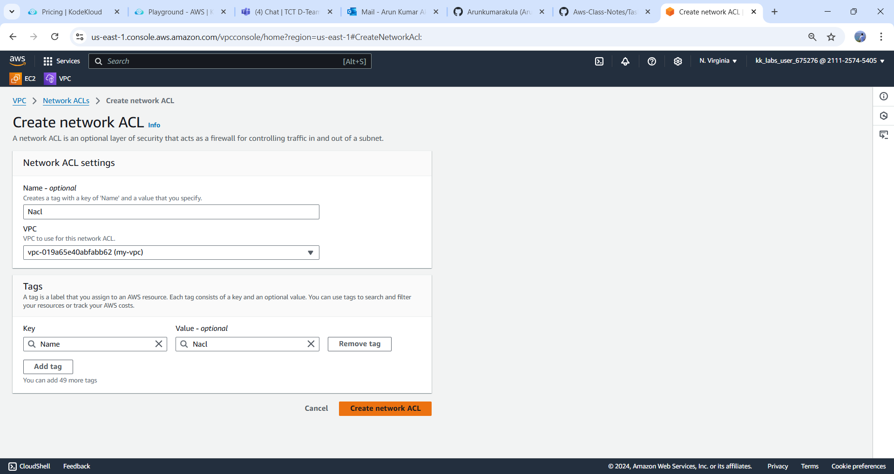

# Project Overview: Real-Time Web Application in AWS VPC

This project will guide you through creating a web application that receives and responds to requests in real-time using AWS networking components within a Virtual Private Cloud (VPC). The main steps include setting up a VPC, configuring subnets, and launching an EC2 instance to host the web application.

---

## Step-by-Step Guide

### Step 1: Create a VPC
* vpc is used to create a secure, isolated private network within a public cloud
1. **Log in to the AWS Management Console** and navigate to the **VPC** dashboard.

2. **Create a New VPC:**
   - `Click` on "Create VPC."
   - Enter a name for your VPC (e.g., `MyVPC`).
   - Use an appropriate CIDR block (e.g., `10.0.0.0/16`).
   - Click "Create."

   
   

---

### Step 2: Create Subnets

1. **Create Public Subnet:**

* subnets Subnets are used to make networks more efficient, secure, and easier to manage
   - Go to the **Subnets** section.
   - Click on "Create subnet."
   - Choose your VPC from the dropdown.
   - Name the subnet (e.g., `PublicSubnet`).
   - Specify a CIDR block (e.g., `10.0.0.0/24`).
   - Choose an Availability Zone.
   - Click "Create."

   


2. **Create Private Subnet:**
   - Repeat the above steps to create a private subnet (e.g., `PrivateSubnet` with CIDR `10.0.2.0/24`).
       
   

### Step 3: Set Up an Internet Gateway
* Internet Gateway  is a device that connects networks and allows communication between a virtual private cloud (VPC) and the internet
1. **Create an Internet Gateway:**
   - Go to the **Internet Gateways** section.
   - Click "Create Internet Gateway."
   - Name it (e.g., `IGW`).
   - Click "Create."

   

2. **Attach the Internet Gateway to Your VPC:**
   - Select the Internet Gateway and click on "Actions" > "Attach to VPC."
   - Choose your VPC and click "Attach."

   

---

### Step 4: Configure Route Tables
* VPC route table is used to direct network traffic within a Virtual Private Cloud (VPC) by specifying the destination and target for each route

1. **Create a Route Table for the Public Subnet:**
   - Go to the **Route Tables** section.
   - Click on "Create route table."
   - Name it (e.g., `PublicRT`).
   - Choose your VPC and click "Create."

   

2. **Add Route to the Route Table:**
   - Select your public route table.
   - Click on the "Routes" tab and then "Edit routes."
   - Click "Add route," set the destination as `0.0.0.0/0`, and target as your Internet Gateway.
   - Click "Save routes."

   

3. **Associate the Route Table with the Public Subnet:**
   - Go to the "Subnet Associations" tab.
   - Click "Edit subnet associations."
   - Select your public subnet and click "Save."

   

4. **Private Route Table (optional):**
   - Ensure the private subnet has the default route pointing to the local VPC only.

   
---

### Step 5: Set Up Network ACLs

*` NACL is used to control traffic in and out of a virtual private cloud (VPC) subnet`
1. **Create a Network ACL:**
   - Go to the **Network ACLs** section.
   - Click "Create network ACL."
   - Name it (e.g., `NACL`) and choose your VPC.
   - Click "Create."

   

* `inbound and outbound rules control the traffic that goes to and from your Amazon EC2 instances`

2. **Configure Inbound Rules:**
   - Select the NACL and go to the "Inbound rules" tab.
   - Click "Edit inbound rules."
   - Add rules to allow HTTP (port 80) and HTTPS (port 443) traffic.
     - Rule #100: Type: HTTP, Protocol: TCP, Port range: 80, Source: 0.0.0.0/0 (Allow all)
     - Rule #110: Type: HTTPS, Protocol: TCP, Port range: 443, Source: 0.0.0.0/0 (Allow all)

   

3. **Configure Outbound Rules:**
   - Go to the "Outbound rules" tab and click "Edit outbound rules."
   - Add rules to allow all outbound traffic (Rule #100: Type: All Traffic, Protocol: All, Port range: All, Destination: 0.0.0.0/0).

   

4. **Associate the NACL with the Public Subnet:**
* `Nacl with the public subnet allows you to control traffic in and out of the subnet`
   - Go to the "Subnet associations" tab.
   - Click "Edit subnet associations."
   - Select your public subnet and click "Save."

   

---

### Step 6: Launch an EC2 Instance

* ` instance is a virtual server that you can use to run applications`

1. **Navigate to the EC2 Dashboard:**
   - Click on "Launch Instance."
   - Choose an Amazon Machine Image (AMI), such as **Amazon Linux 2**.
   - Select an instance type (e.g., `t2.micro`).
   - In the "Configure Instance" step, ensure you select your VPC and the public subnet.
   - Configure storage and security group (allow inbound traffic on HTTP and SSH).
   - Review and launch the instance.

   

2. **Get the Public IP Address:**
   - After launching, note the public IP address of the instance.
 
   
---

### Step 7: Set Up a Simple Web Application

1. **SSH into Your EC2 Instance:**

 `SSH provides a secure way to access a remote server`
   
  *  ssh -i your-key.pem ec2-user@your-instance-public-ip

  * while connecting i get this below error due to not configured Nacl Association

     


2. **Install a Simple Web Server:**
```
   sudo yum update -y
   sudo yum install -y httpd
   ```
 ` HTTPD  is a software program that acts as a server in a client-server `

3. **Start the Web Server:**
   ```bash
   sudo systemctl start httpd
   sudo systemctl enable httpd
   ```

4. **Create a Simple HTML Page:**
   ```bash
   echo "<html><h1>Welcome to My VPC Web App</h1></html>" | sudo tee /var/www/html/index.html
   ```

5. **Access Your Application:**
   - Open a web browser and navigate to `http://your-instance-public-ip`. You should see the welcome page.


